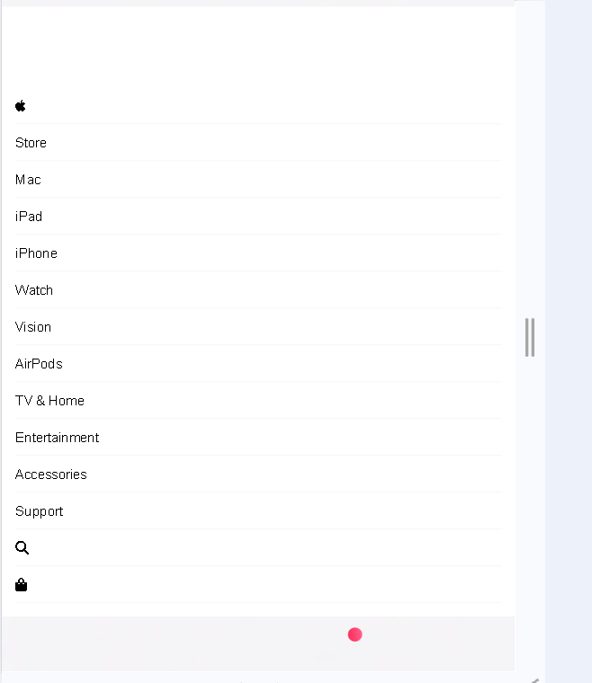

# 🍏 Apple Landing Page

A responsive Apple-inspired landing page built with HTML, CSS, and JavaScript.
Built as a UI/UX recreation project to practice responsive navigation,
dropdown interactions, and mobile menu functionality using vanilla JavaScript.

---

## 🌐 Demo

https://apple-landing-page-valentine-editio.vercel.app/

---

## 📸 Preview





## ✨ Features

- Fully responsive navigation bar  
- Hoverable dropdown menus for product categories (Mac, iPad, iPhone, Watch, Vision, AirPods, TV & Home, Entertainment, Accessories, Support)  
- Mobile-friendly hamburger menu with toggle functionality   
- Clean, Apple-style minimalist design

---

## 🛠 Technologies Used

- **HTML5** – Semantic structure  
- **CSS3** – Styling & responsive design  
- **JavaScript** – Hamburger menu and submenu toggle  
- **Font Awesome** – Icons for Apple logo, search, and shopping bag  

---

## 📂 Project Structure  
apple-landing-page/
│
├── index.html # Main landing page
├── CSS/
│ └── style.css # Desktop and mobile styles
├── images/ # Images used in the page
│ └── background.png
└── README.md # This documentation


---

## ⚡ Installation

1. Clone the repository:

```bash
git clone https://github.com/M-gatwiri/apple-landing-page-valentine-edition.git
```

2. Open `index.html` in your browser.

## 🚀 Usage

- Hover over navigation links to reveal dropdown menus.
- On mobile, click the hamburger menu to expand navigation.
- Customize the hero section, colors, and content by editing `index.html` and `style.css`.


